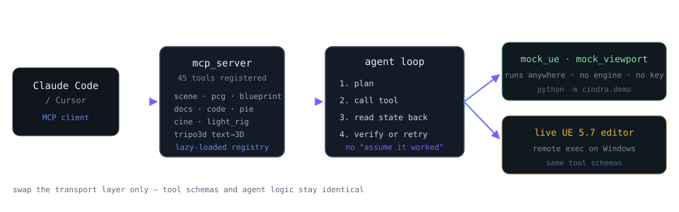

  

  
  
  

---

## What I build

Two kinds of tools, one shared rule: **make the system prove it worked.**

- **Instruments** that measure LLM infrastructure honestly — percentiles from a monotonic clock, coordinated-omission correction, formulas you can recompute from the raw samples.
- **Agents** that touch a real engine, then read the engine's actual state back to verify the change landed.

  

## precision-bench

**Why it exists:** anyone can show you a pretty latency curve. Nobody can tell you whether the channel is actually fast, actually caching, and actually serving the model it claims. This one can.

- Closed-loop, open-loop (**coordinated-omission correction**, wrk2/k6 methodology), and duration profiles
- TTFT / TPOT / ITL / E2E percentiles to P99.9, measured off the SSE stream with a monotonic clock
- Active fixed-prefix cache probe — catches relays that report cached tokens without serving them faster
- Eight scored quality dimensions with per-channel baseline and output-fingerprint comparison
- Goodput against SLO targets; cost split across input / output / cache-read / cache-write
- SQLite (WAL), CSV/JSON/Markdown export, one-click channel verification report
- 88 tests · 63.6% coverage · CI green · non-root Docker image · published release

  
   
  multi-channel comparison: success, goodput, RPS, E2E, TTFT, TPOT, tok/s, cache hit

## ue5-ai-commander

**Why it exists:** "the agent said it applied the change" is not verification. This one screenshots the viewport and reads the graph back.

Natural-language control for Unreal Engine 5.7 — scene editing, PCG procedural generation, Blueprints, project-style C++, engine Q&A over RAG, cinematics, lighting, PIE automation, Tripo3D text-to-3D. 43 modules, 45 registered MCP tools, 103 assertions.

  
   
  141 oaks scattered by one PCG pipeline (landscape → sampler → flat-only filter → random transform → spawn) across 200×200 m. Mock backend: no engine, no API key — <code>python -m cindra.demo</code>

  
  

The mock/live split is the point: the whole pipeline is verified offline on a Mac against a mock, then driven against a live editor on Windows by swapping **only the transport layer** — tool schemas and agent logic stay byte-identical.

## Principles

<table>
<tr><td width="50%">

**Measure before claiming**
Percentiles from `time.perf_counter()`, formulas documented, recomputable from the raw samples. Warmup excluded. Error classes enumerated, not lumped into "failed".

</td><td width="50%">

**Verify, don't assume**
After acting, read the real state back. A green CI run proves tests pass — it does not prove the feature works.

</td></tr>
<tr><td>

**Mock first, engine second**
Deterministic offline validation before touching a live system. Reproduce a failure on a laptop, not in a 3 a.m. editor crash.

</td><td>

**Least surprise**
No telemetry, no hidden network calls, keys never written to disk, no multi-worker fantasy — live state lives in one process and the code says so.

</td></tr>
</table>

<b>中文</b>

 

做两类工具，共享一条原则：**让系统自证它真的成了。**

- **测量仪器** —— 把 LLM 基础设施测准。单调时钟取分位、定频模式带 coordinated omission 修正、公式公开可从原始样本复算。
- **控制代理** —— 动真引擎，然后读回真实状态自检。"agent 说改好了" 不等于验证。

**[precision-bench](https://github.com/JediKinght9527/precision-bench)** — LLM 中转 API 压测 / 缓存验真 / 降智检测。并发、定频（CO 修正）、时长三种负载；TTFT、TPOT、ITL、E2E 到 P99.9；固定长前缀主动探缓存，揪出「上报命中但不加速」的假缓存；八个维度判分 + 渠道基线与输出指纹对比；goodput 对 SLO；成本拆成输入/输出/缓存读/缓存写。88 测试、63.6% 覆盖率、CI 全绿、非 root 镜像。

**[ue5-ai-commander](https://github.com/JediKinght9527/ue5-ai-commander)** — 自然语言操控 UE 5.7。场景编辑、PCG 程序化生成、蓝图、项目风格 C++、RAG 引擎问答、运镜、灯光、PIE 自动化、Tripo3D 文生 3D。43 个模块、45 个注册 MCP 工具、103 条断言。mock / 真实双后端：先在 Mac 上用 mock 验证整条链路，再只换传输层驱动 Windows 上的真实编辑器。

工作原则：先测量再下结论；执行后读回真实状态；mock 先行离线验证；不埋点、不偷偷联外网、密钥不落盘。

---

  <picture>
    <source media="(prefers-color-scheme: dark)" srcset="https://raw.githubusercontent.com/JediKinght9527/JediKinght9527/main/output/github-contribution-grid-snake-dark.svg">
    <source media="(prefers-color-scheme: light)" srcset="https://raw.githubusercontent.com/JediKinght9527/JediKinght9527/main/output/github-contribution-grid-snake.svg">
    
  </picture>

